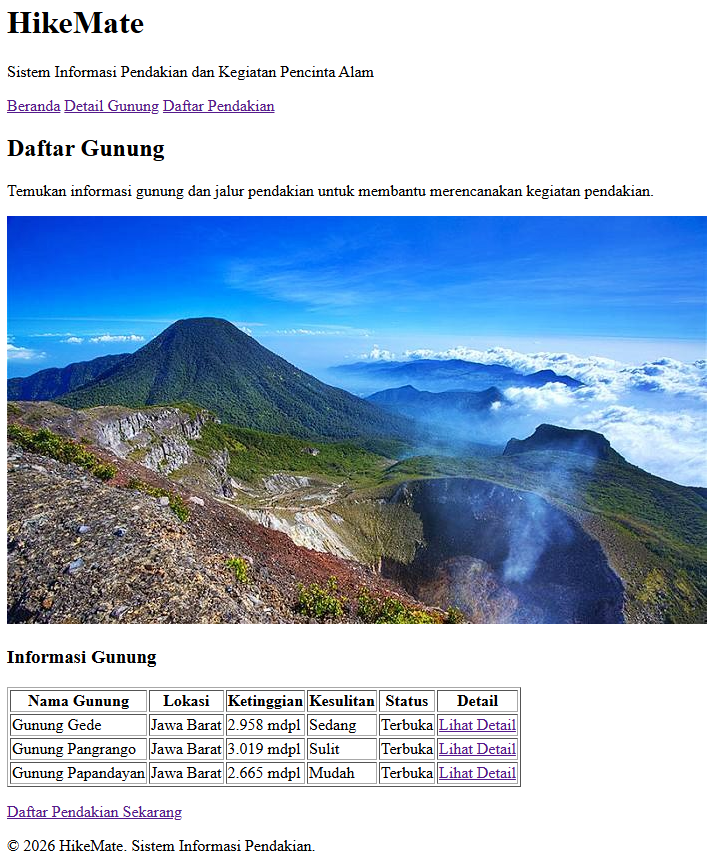
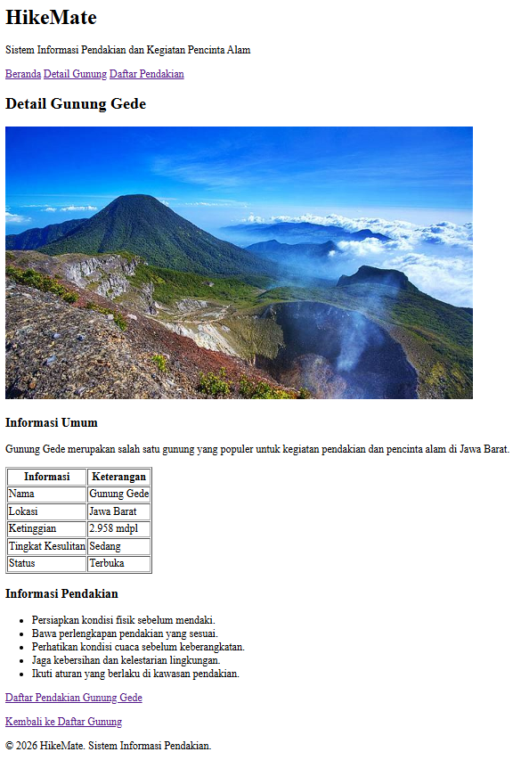
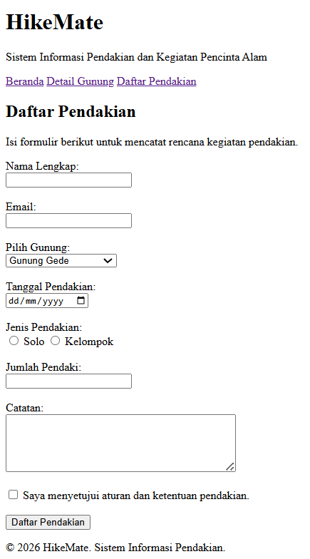

# HikeMate

HikeMate adalah sistem informasi sederhana untuk membantu pengguna
mendapatkan informasi mengenai gunung dan merencanakan kegiatan pendakian.

## Halaman Website

### Beranda
Menampilkan informasi utama dan daftar gunung yang tersedia.

### Detail Gunung
Menampilkan informasi detail mengenai Gunung Gede.

### Daftar Pendakian
Menyediakan formulir untuk mencatat rencana kegiatan pendakian.

## Screenshot

### Beranda

### Detail Gunung

### Daftar Pendakian
