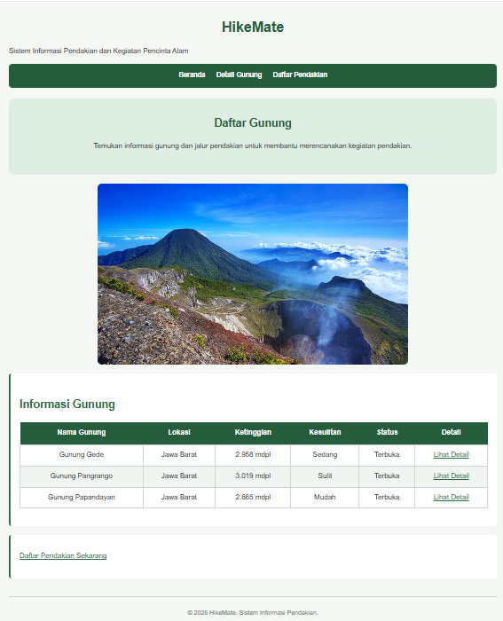
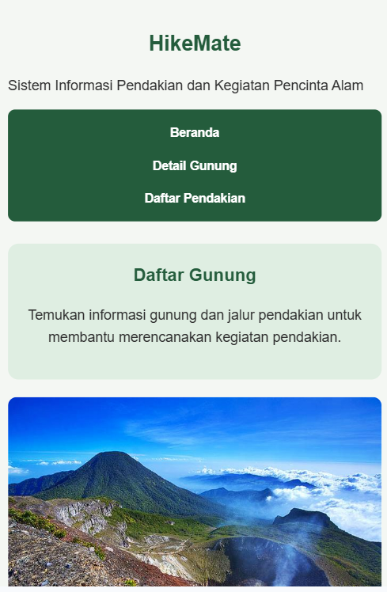

# HikeMate

HikeMate adalah sistem informasi sederhana untuk membantu pengguna
mendapatkan informasi mengenai gunung dan merencanakan kegiatan pendakian.

## Halaman Website

### Beranda
Menampilkan informasi utama dan daftar gunung yang tersedia.

### Detail Gunung
Menampilkan informasi detail mengenai Gunung Gede.

### Daftar Pendakian
Menyediakan formulir untuk mencatat rencana kegiatan pendakian.

## Screenshot

### Beranda

### Detail Gunung

### Daftar Pendakian

## Tugas 3 - CSS

Pada Tugas 3, project HikeMate dikembangkan dengan menerapkan
CSS native menggunakan external stylesheet `style.css`.

Penerapan CSS meliputi:

- Font family, font size, dan font weight
- Styling navigasi dan list
- Text alignment
- Warna background dan teks
- Styling tabel
- Styling form
- Penggunaan div untuk pengelompokan elemen
- Responsive design menggunakan media query

### Screenshot Desktop

### Screenshot Mobile

